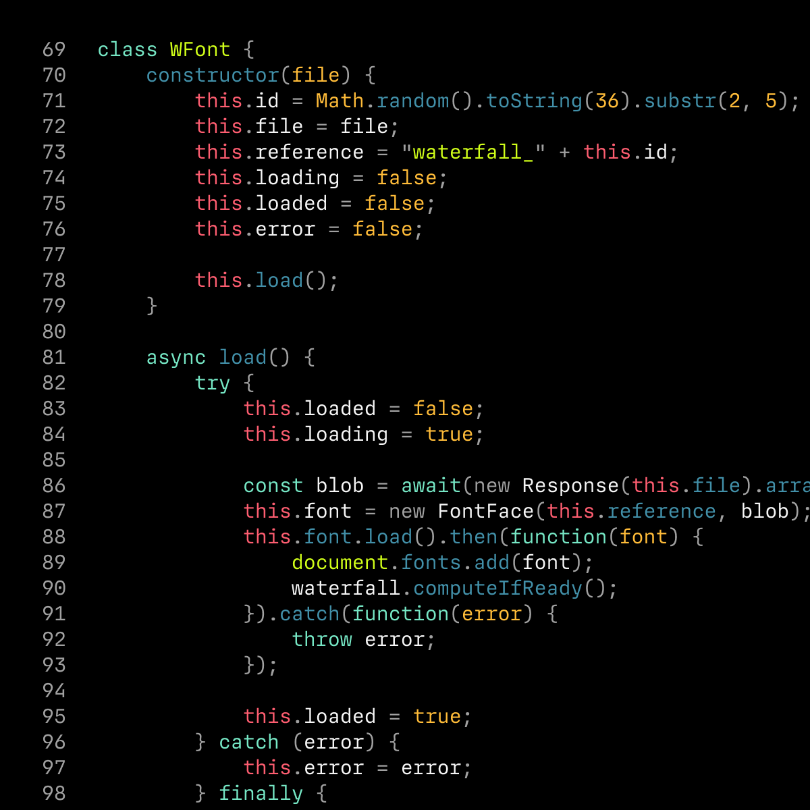
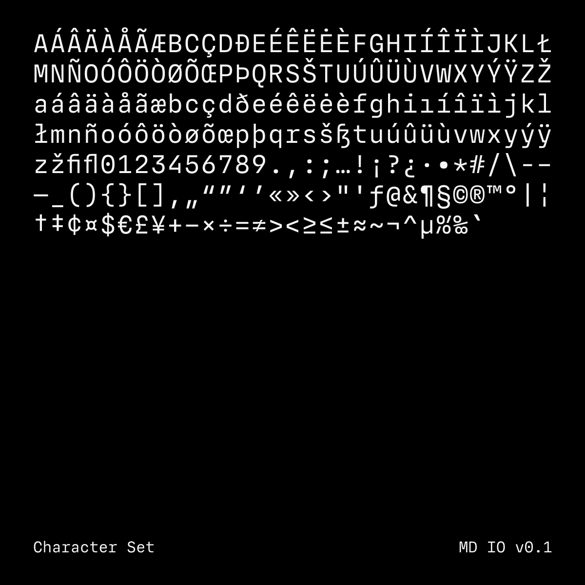

# MD IO
This repo is a public feature and issue tracker for MD IO, a typeface currently under development and available through [Future Fonts](https://www.futurefonts.xyz/mass-driver/io). Upcoming changes, bug reports, feature requests and issues are centrally documented and tracked through this repo.

If you have a request for a new feature (such as support for a particular character [set] or a new OpenType feature), or if you discover a visual or technical issue, please [open an issue](https://github.com/mass-driver/md-io/issues). I can’t guarantee every suggestion will be implemented, however I will try to fix any technical issue (within reason).

> __Note:__
> This font is not open-source. To purchase a license for desktop and web use, please visit [Future Fonts](https://www.futurefonts.xyz/mass-driver/io). This repo exists only to track issues during the ongoing development of MD IO.

## Status
The current release is version `0.3`, with three styles, `Regular`, `Italic` and `Bold`. This release is internal version `79`.

The next release, version `0.4`, is scheduled for November 29, 2021, and adds four new weights along with character set expansions and a number of smaller changes.

## Images

